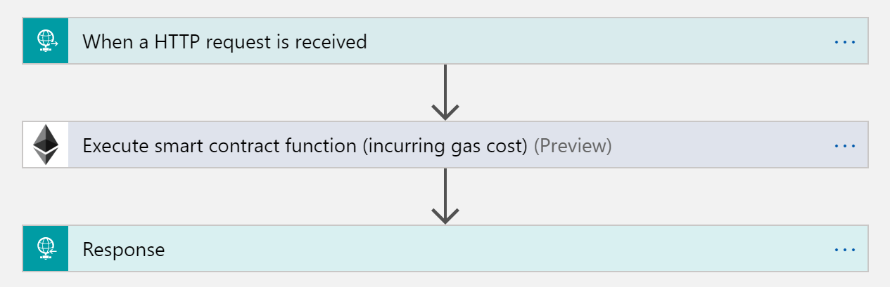
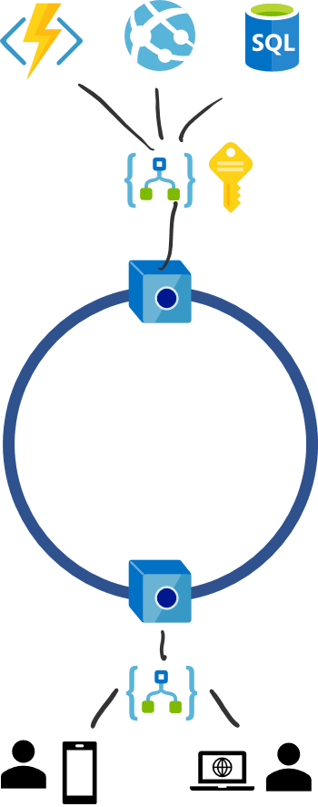
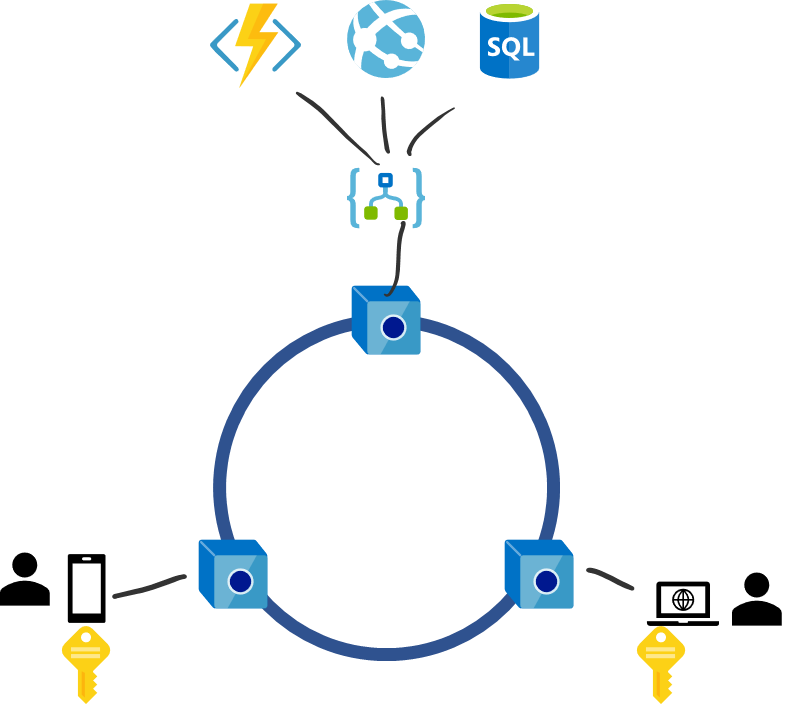

### Architecturing for Enterprise Blockchain Use Cases

Authors: [David Burela](https://www.linkedin.com/in/davidburela/) and [Whitney Griffith](https://www.linkedin.com/in/whitneygriffith/) 

## Introduction

Architecting blockchain applications is more complex than a traditional “3 tier application” with a business logic backend and a firewalled database. There is no “one size fits all” and architecture decisions vary wildly depending on: who the application is targeting, the sensitivity levels of the data, and where the slider sits on centralised vs decentralised based on the goals of the project.
We have simplified it down to 4 common architectures I use as a base, and then customise from there. 

## Core Tenants of Blockchain FIRST Development 

**Blockchain is the source of truth**

Each company may have their own business logic and databases, but for data / processes shared on the blockchain, what is stored in the Blockchain should be taken as the objectively true confirmed state. Each company’s datastores need to respect the state of the Blockchain.

**External systems react to events occurring on the blockchain**

Parties communicate to each other through the Blockchain via smart contracts. The state changes will trigger events which can be listened for. This can allow one party to update a package tracking info, which results in a business process being trigged within another company.

**Each party has a trusted node that they control**

If you interact through a traditional centralised REST API that another party controls, you cannot be certain that the data has not been modified before being transmitted to you. This is true regardless of if the underlying data store is SQL or Blockchain.  This is negated by hosting your own node and querying it directly. If you were to instead query a node that another party controls, you can not be certain that they have not spoofed the results at the RPC layer. (Note: There is research in this area with “Light Clients” which is out of scope for this document).

## Basic Architecture Pattern for Each Member 

Each member within a consortium will have a standard set of components to connect and integrate with the Blockchain network.

* Blockchain node that they control in their subscription: [Azure Blockchain Service](https://aka.ms/ABService)

* Interface between backend systems and Blockchain node: [Azure Logic app](https://azure.microsoft.com/en-us/services/logic-apps/)

* Event driven connectors: [Azure Logic app](https://azure.microsoft.com/en-us/services/logic-apps/) + [Azure Event Grid](https://azure.microsoft.com/en-us/services/event-grid/)

### Blockchain Node

Each member requires blockchain nodes that they control within their own subscription:
1.	To ensure that they are securing the network and can trust that the Blockchain has not been rewritten with a different set of blocks. 
2.	The Blockchain node acts as your own replicated datastore. It is essential to have it co-located with your other Azure resources to ensure low latency when querying smart contract state.

### Ethereum Logic App Connector 

The logic app connector acts as the glue between a traditional backend and the blockchain. There are 2 main pattern: reading/writing to the blockchain via smart contracts, and reacting to events on the network.

Reading/writing
This is the most basic building block. This exposes specific smart functions as a HTTP endpoint that can be called by any backend. 

A single smart contract will typically have a number of Logic Apps defined for it. 1-2 for calling the functions that return values (query a smart contract). And a set that triggers state changes within the contract by submitting transactions.

The “When a HTTP request is received” action can define the expected JSON object that will be passed into the call. Allowing parameters to be passed through to the Ethereum call. The “Response” action can return results from the Ethereum action.

Azure functions are typically used to encapsulate more complex querying scenarios. Front end systems can be attached to these logic apps, with websites or Power Apps giving UI for users to interact with.

### Event Driven Logic 

When another member performs an action on a smart contract, it will typically raise an event to notify those that are interested. E.g. a parcel is updated with a new status, and others want to be notified and react.

The blockchain event can be listened for and forwarded to Event Grid, which allows further event driven logic such as triggering a new purchase order or loading the data into Power BI. In simpler scenarios the event can just be act upon directly, such as exporting it to a SQL server for analysis.

This can drive event based systems powered by serverless computing, where the handling logic is run in Logic Apps or in Azure Functions.

## Market Segment 

Most architectures will be variations of the basic architecture pattern presented earlier. The largest deciding factor on architecture is the market segment that the application is targeting, as well as how much ownership the individual end users have over their keys. One way to view it as a spectrum from the B2B private consortiums on one end where everything is fully controlled, and identities managed for the individual employees. To full decentralisation with each end user being in control of their identities, but also meaning that everything is trustless without centralised control points. There is no “correct” pattern as it greatly dependant on the application’s target, but generally when end consumers are involved, learning further towards decentralisation by having Decentralised Ids with managed application services is the best balance.

### B2B (Business to Business)

**Network type**: Consortium network.

**Security**: AAD + Azure Keyvault

**Integration**: Azure Logic Apps

**Front end**: Power Apps, Power BI, Azure websites

**Common scenarios**: “Industry chain” within a region (agriculture, mining, cargo). Partner companies streamlining operations

This architecture is used commonly in scenarios with a company and its close business partners to streamline their existing operations. For example, an insurance company that wants to deeply integrate with their network of suppliers. Usually when there is one large company and a collection of smaller companies that supply them.

Industry chains are at the next scale up and incorporate many companies within a vertical. E.g. cargo companies and airlines working together in an industry chain for space allocation and package tracking, or a commodity industry chain to track bulk supply sales.

Each party hosts the basic infrastructure shown earlier. They each host the independent infrastructure (Blockchain node, logic apps, etc) and coordinate through smart contracts. A good litmus test of if it has been architected well, is that any one of the companies could shut down tomorrow, and it would not impact the remaining members. 

There are situations where these requirements can be relaxed, most commonly is when bootstrapping a massive Industry chain and the smaller members aren’t ready to host the infrastructure. In this case a founding member could host the nodes in a separate Azure subscription on their behalf but grant them full access. This can be a good stopgap to help kickstart the network.

### B2C (Business to Consumer) - Centralized

**Network type**: Permissioned network, public network / plasma chains.

Security****: Azure Key vault 

**Integration**: Azure Logic apps

**Front end**: Power Apps, Azure websites, mobile app

**Common scenarios**: Verification, provenance, supply chain

Here the bulk of the infrastructure is hosted by the enterprises that are providing the service. The consumers typically aren’t submitting things to the blockchain and are instead are looking up data on the Blockchain for verification of claims. This means that consumers may not need Blockchain identities or keys, simplifying the architecture. If the consumer does need to submit a transaction, the signing key is typically held by the enterprise who signs on their behalf and is kept in Azure Keyvault.

A common scenario here is a consumer verifying that the product that they are purchasing is legitimate and can have its provenance traced through the supply chain right back to the original raw materials.

The enterprise will supply to the consumer the mobile phone app / website that is used to scan the QR code of the product or look up a serial number. This will typically connect to an API that is hosted by the Enterprise, to allow for quick query times and reduce network difficulties.

While this allows for very simple development of the consumer apps as it is similar to existing apps, it does have the downside of centralisation and questions of “can we really trust this data”. Mitigating strategies can be put in place, such as providing a link within the UI that will launch a block explorer showing the history of transactions against that object. Blockchain "Light clients” can be used in the client app to give stronger assurances of the data validity.

### B2C (Business to Consumer) - Decentraliaed 

**Network type**: Permissioned network, public network / plasma chains.

**Security**: Azure Key vault for Enterprise. DID (Decentralised ID) for consumer

**Integration**: Azure Logic apps for Enterprise. Web3 for consumer

**Front end**: Mobile app, IPFS, Azure websites, Metamask

**Common scenarios**: Digital asset ownership, video game items, commerce

This time the consumers are active participants and want to submit transactions. The fundamental architectural difference here is that the consumers will own their identities and keys, which they will use to sign transactions themselves. The enterprise is providing a service and the users are owning digital assets (train tickets) or in game items (playing cards, skins). They use the keys on their devices to sign transactions to interact with these items or purchase new ones.

The client app can submit the signed transaction to the network, or to a transaction node hosted by the enterprise. Light clients can be used to further decentralise. 

### C2C (Consumer to Consumer)

**Network type**: Public network, child plasma chains.

**Security**: DID (Decentralised ID)

**Integration**: Web3 for consumer

**Front end**: Mobile app, IPFS, Azure websites, Metamask

**Common scenarios**: Digital asset ownership, commerce, trustless interactions

In this scenario, the consumers are not only active participants and are able to submit transactions to the blockchain but they also have the option to provide the foundation and computing resources for maintaining the network’s validity/source of truth.  Each consumer in the network is considered equal and a consumer completely owns their identities and keys, which they will use to sign all their transactions. However in contradiction to the Business to Consumer model, each consumer in the network also have the option to provide a service and/or own digital assets and thus independently engage in commerce, transfers of digital asset ownership, and trustless interactions with other consumers in the network. In most if not all cases, once a valid transaction between consumers have occurred that transaction cannot be reversed and there isn’t a central party or business who can facilitate reparations. 

## Programming Model 

### Data Definition 

Blockchain is not a database and shouldn’t be used as such. A common mistake is to put everything that is stored in a database into the smart contract, however this will bloat the blockchain unnecessarily. An important question to ask is “WHAT am I trying to prove to WHO” and only store the limited pieces of data that is required to support that. Typically this will be Id, current status, current owner, etc.

Due to the open nature of blockchain data it is important to remember that everything that is stored can be read, so avoid entering any PII or commercially sensitive data.

Using excel to map out the minimum number of fields required for each object in your application is typically a good place to start planning which smart contracts will be required.

### Smart Contracts 

If you are an Object-Oriented developer it may be helpful to think of smart contracts as Classes, and deployed instances of the contracts as stateful, long lived objects. For example, you would have a Package contract, and for each new package that is to be tracked a new instance is deployed. Each package will then have its own unique address in the Blockchain and can be individually queried and acted upon. Actor-based programming can be a useful paradigm to employ due to each instance encapsulating its data and state change logic.

Singleton vs instances is another aspect to consider. Typically, a singleton instance is used for controlling or lookup contracts (e.g. factory contract, directory of companies, reference data), and individual instances are used for unique objects. Try to avoid the common pitfall of creating a singleton contract that has an array of structs to hold the individual objects. In many scenarios they can be extracted into their own contracts and vastly simplify access and update logic and permission enforcement.

### Private Transactions 

General guidance is while private transactions are available in platforms like Quorum, you should try to avoid using them for v1 of your proof of concept. Due to the vastly different programming models of Blockchain over traditional systems, many systems developers fall into the trap of trying to replicate their existing models. This results in many 1:1 point to point private transactions taking place.

Instead try to create v1 of your system with as much value in the central “shared” blockchain area as possible. This helps create more value and creates initial contracts that can then be extended upon. The more contracts and mini apps that are in the shared area, the more that networking effects can take hold with further apps being built on top. It also helps get new developers to think in the new “Blockchain first” mindset.

Once v1 of the system has been released, frequently the need for private transactions has been negated as a deeper understanding of Blockchain and its capabilities are understood. There of course are always instances where private transactions are required, and so later in a v2 or v3 they can be layered on top of the existing open base once the deeper understanding has been obtained.

### DevOps 

See whitepaper on [Blockchain DevOps](https://aka.ms/bcdevops) 

